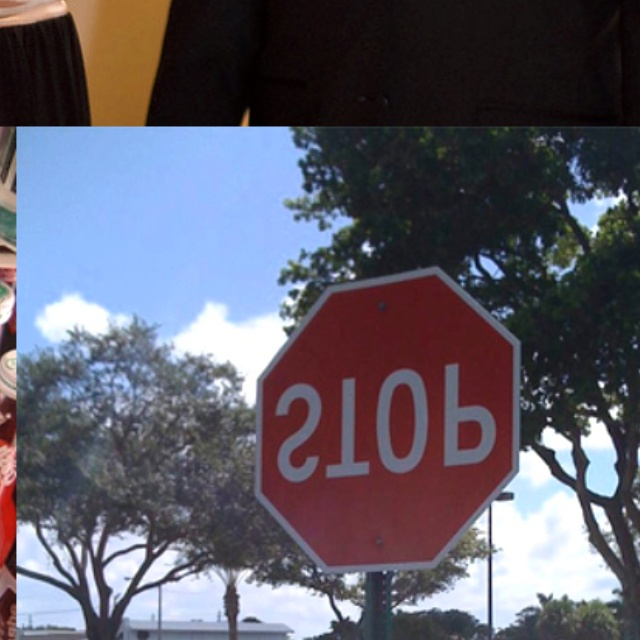

# YOLOv7 - to detect the smallest and largest objects

Implementation of paper - [YOLOv7: Trainable bag-of-freebies sets new state-of-the-art for real-time object detectors](https://arxiv.org/abs/2207.02696)

## Installation

Docker environment (recommended)
<details><summary> <b>Expand</b> </summary>

``` shell
# create the docker container, you can change the share memory size if you have more.
nvidia-docker run --name yolov7 -it -v your_coco_path/:/coco/ -v your_code_path/:/yolov7 --shm-size=64g nvcr.io/nvidia/pytorch:21.08-py3

# apt install required packages
apt update
apt install -y zip htop screen libgl1-mesa-glx

# pip install required packages
pip install seaborn thop

# go to code folder
cd /yolov7
```

</details>

## Download data (validation data, annotations) and model (yolov7.pt)

``` shell
# Download/unzip labels
!curl -L https://github.com/ultralytics/yolov5/releases/download/v1.0/coco2017labels-segments.zip -o coco2017labels-segments.zip && unzip -q coco2017labels-segments.zip && rm coco2017labels-segments.zip & # download, unzip, remove in background

# Download/unzip images
!curl -L http://images.cocodataset.org/zips/val2017.zip -o val2017.zip && unzip -q val2017.zip -d coco/images && rm val2017.zip & # download, unzip, remove in background

# Download model
wget https://github.com/WongKinYiu/yolov7/releases/download/v0.1/yolov7.pt
```

## Convert COCO dataset only to contain the smallest and largest objects
This step also splits the data for training (90%) and validation (10%)

``` shell
python convert_dataset.py
```

The training data is formed as

<div align="center">
    <a href="./">
        
    </a>
</div>

## Fine-tuning

Single GPU finetuning for a custom dataset

``` shell
python train.py --workers 8 --device 0 --batch-size 32 --data data/custom.yaml --img 640 640 --cfg cfg/training/yolov7_custom.yaml --weights 'yolov7.pt' --name yolov7-custom --hyp data/hyp.scratch.custom.yaml
```

## Inference

On image:
``` shell
python detect.py --weights runs/train/yolov7-custom/weights/best.pt --conf 0.15 --img-size 640 --source inference/images
```

<div align="center">
    <a href="./">
        
        
        
    </a>
</div>

## Image Transformations

During training several transformations are performed as adjusting HSV & flipping. They can be accessed from the transformations directory

<div align="center">
    <a href="./">
        
        
        
    </a>
</div>
Mosaic Styled Images
<div align="center"> 
    <a href="./">
        
        
    </a>
</div>

## Citation
Implementation of paper - [YOLOv7: Trainable bag-of-freebies sets new state-of-the-art for real-time object detectors](https://arxiv.org/abs/2207.02696)

```
@article{wang2022yolov7,
  title={{YOLOv7}: Trainable bag-of-freebies sets new state-of-the-art for real-time object detectors},
  author={Wang, Chien-Yao and Bochkovskiy, Alexey and Liao, Hong-Yuan Mark},
  journal={arXiv preprint arXiv:2207.02696},
  year={2022}
}
```

```
@article{wang2022designing,
  title={Designing Network Design Strategies Through Gradient Path Analysis},
  author={Wang, Chien-Yao and Liao, Hong-Yuan Mark and Yeh, I-Hau},
  journal={arXiv preprint arXiv:2211.04800},
  year={2022}
}
```

## Acknowledgements

<details><summary> <b>Expand</b> </summary>

* [https://github.com/AlexeyAB/darknet](https://github.com/AlexeyAB/darknet)
* [https://github.com/WongKinYiu/yolor](https://github.com/WongKinYiu/yolor)
* [https://github.com/WongKinYiu/PyTorch_YOLOv4](https://github.com/WongKinYiu/PyTorch_YOLOv4)
* [https://github.com/WongKinYiu/ScaledYOLOv4](https://github.com/WongKinYiu/ScaledYOLOv4)
* [https://github.com/Megvii-BaseDetection/YOLOX](https://github.com/Megvii-BaseDetection/YOLOX)
* [https://github.com/ultralytics/yolov3](https://github.com/ultralytics/yolov3)
* [https://github.com/ultralytics/yolov5](https://github.com/ultralytics/yolov5)
* [https://github.com/DingXiaoH/RepVGG](https://github.com/DingXiaoH/RepVGG)
* [https://github.com/JUGGHM/OREPA_CVPR2022](https://github.com/JUGGHM/OREPA_CVPR2022)
* [https://github.com/TexasInstruments/edgeai-yolov5/tree/yolo-pose](https://github.com/TexasInstruments/edgeai-yolov5/tree/yolo-pose)

</details>
